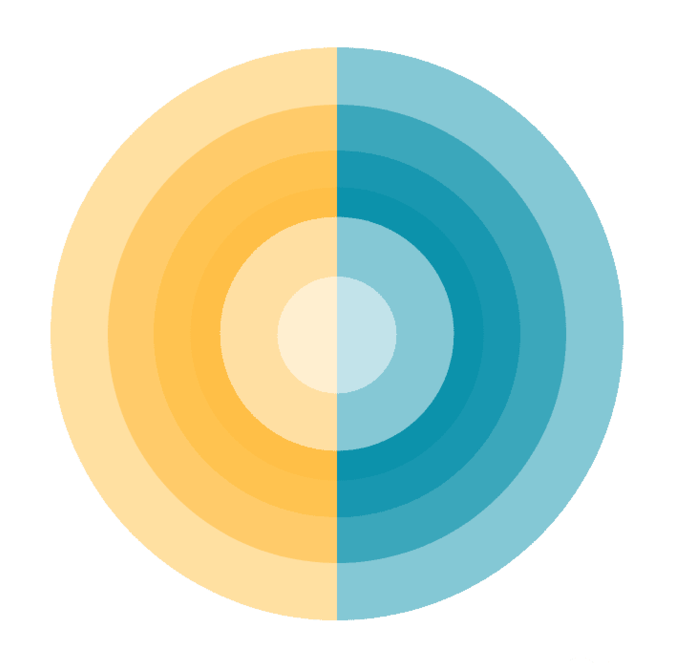

# Cogeração

	

Este software foi desenvolvido por Rafael Araujo Vidal, sob orientação do Professor Sílvio Carlos Aníbal de Almeida, como parte do Projeto de Graduação em Engenharia Mecânica pela Universidade Federal do Rio de Janeiro.

